# dystopia_citygen — Benchmark Results

This folder records **benchmark runs** for the dystopia_citygen pipeline: generating a Dystopia map from a natural-language prompt, building the VMF, running a test compile, and fixing any issues so the map loads in-game.

---

## What Was Done

1. **Prompt-driven generation** — A single instruction was given to the generator (see [Prompt](#prompt-used) below).
2. **Map naming** — The generated map was named `dys_<model-name>.vmf` (e.g. `dys_composer_1_5.vmf`) so runs are easy to identify.
3. **Build & compile** — The pipeline was run to produce the VMF and then a **test compile** was executed to ensure the map compiles with the game’s tools.
4. **Fix-up** — Any compile or load errors were diagnosed and fixed so the map runs correctly in Dystopia.
5. **In-game capture** — A screenshot was taken inside Dystopia to document the result and confirm the map loads and looks as intended.

---

## Prompt Used

The following prompt was used for this benchmark:

```
@README.md generate a fancy dystopia map following instructions and call it dys_<model-name>.vmf, after building do a test compile and fix any issues
```

*(Stored in `prompt.txt` in this folder.)*

---

## Benchmark Results

In-game screenshots for each benchmark run. Each map was generated from the same prompt, built to VMF, test-compiled, and fixed as needed so it loads in Dystopia.

| Run | Screenshot |
|-----|------------|
| dys_codex_5_3_thinking | 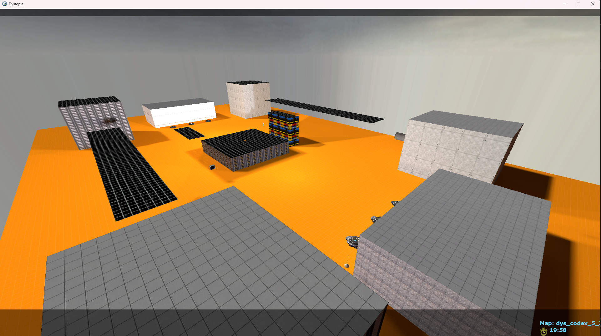 |
| dys_composer_1_5_thinking | 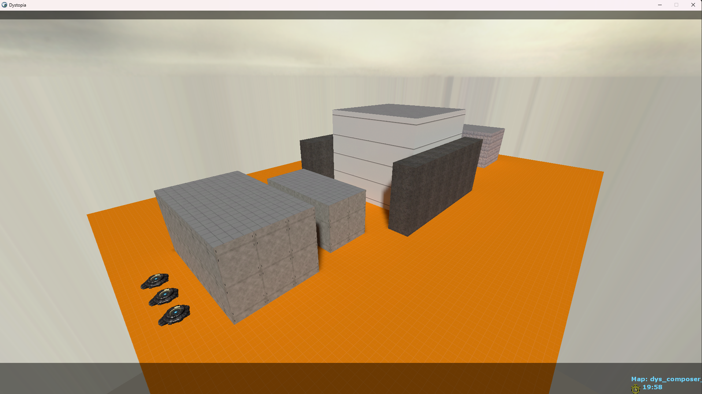 |
| dys_gemini_3_1_pro | 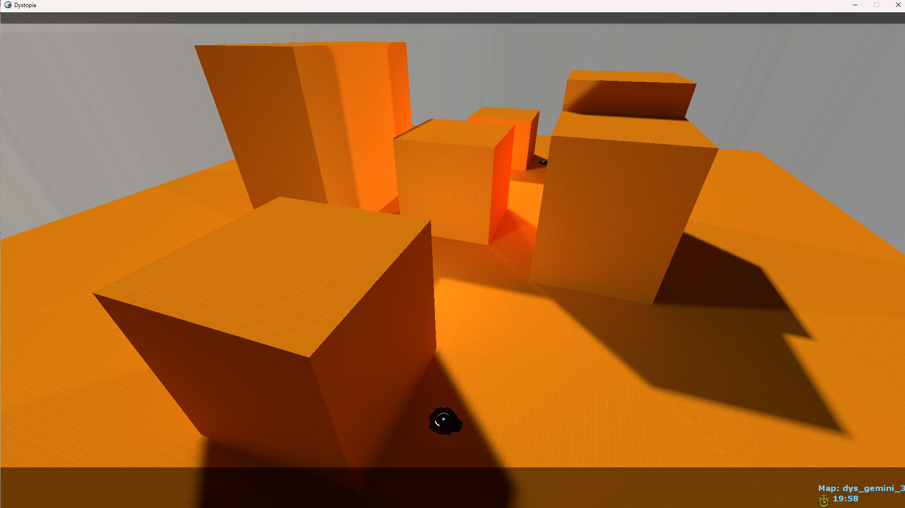 |
| dys_gpt_5_4 | 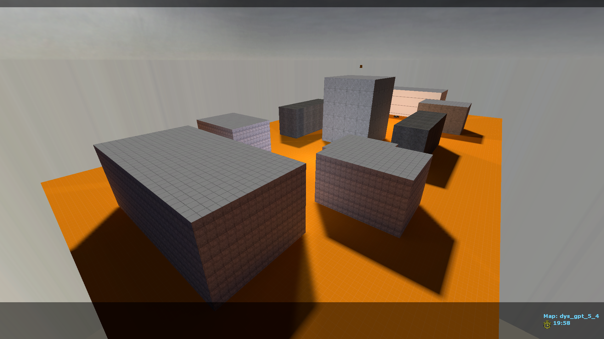 |
| dys_gpt_5_4_high | 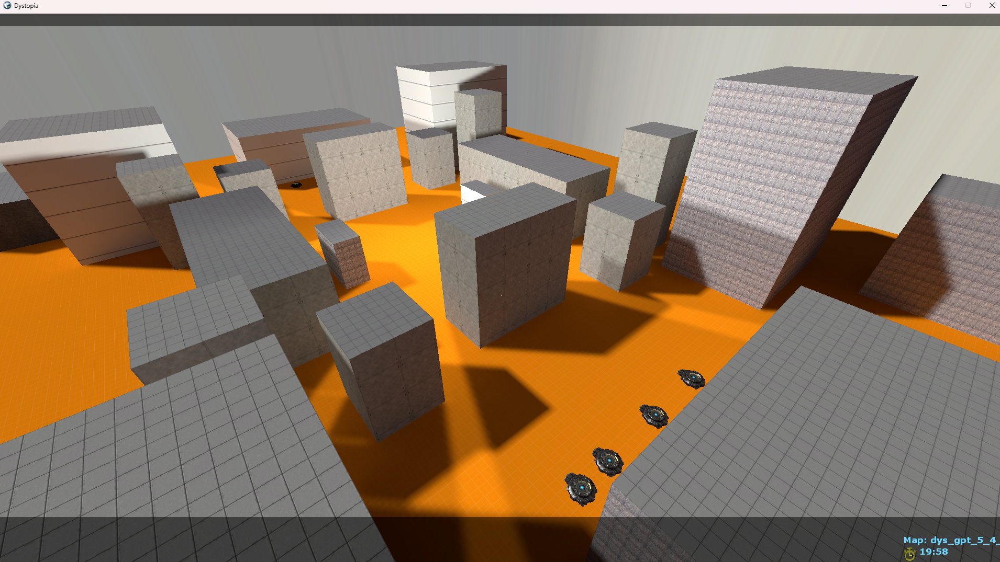 |
| dys_gpt_5_4_xhigh | 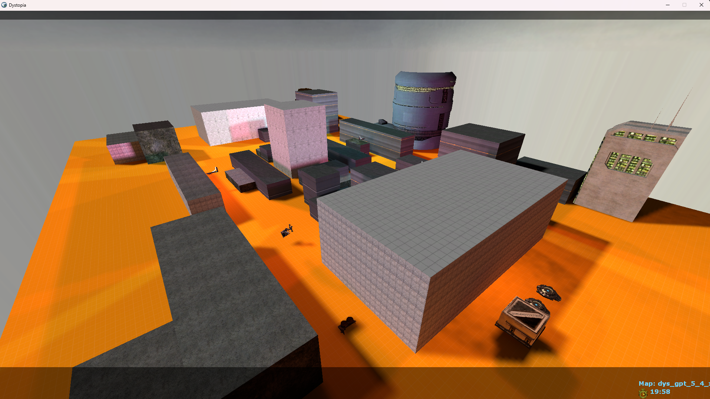 |
| dys_kimi_k25 | 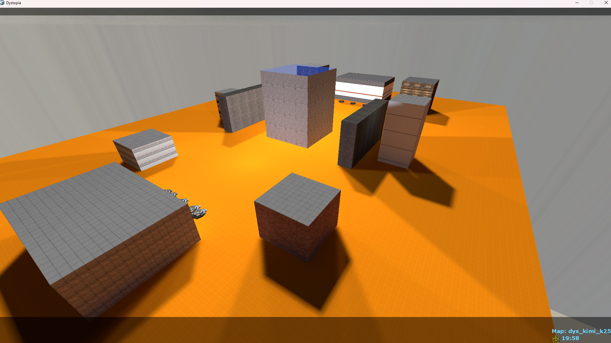 |
| dys_opus_4_6 | 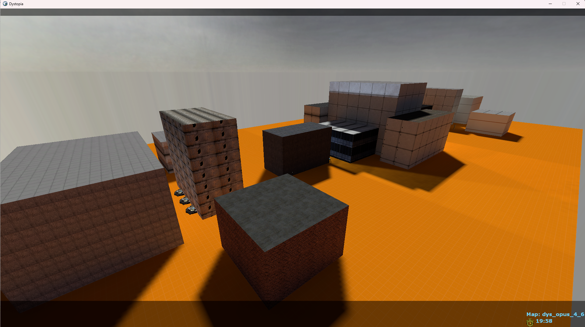 |
| dys_opus_4_6_think | 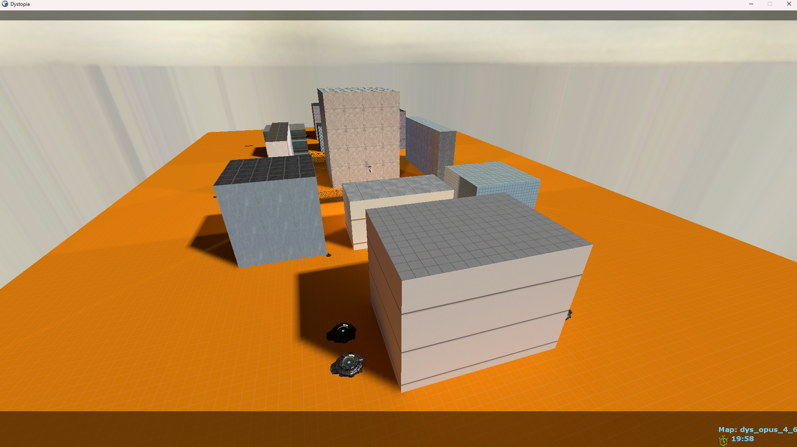 |
| dys_sonnet_4_6 | 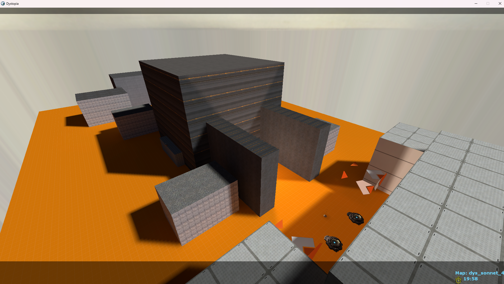 |
| dys_sonnet_4_6_think | 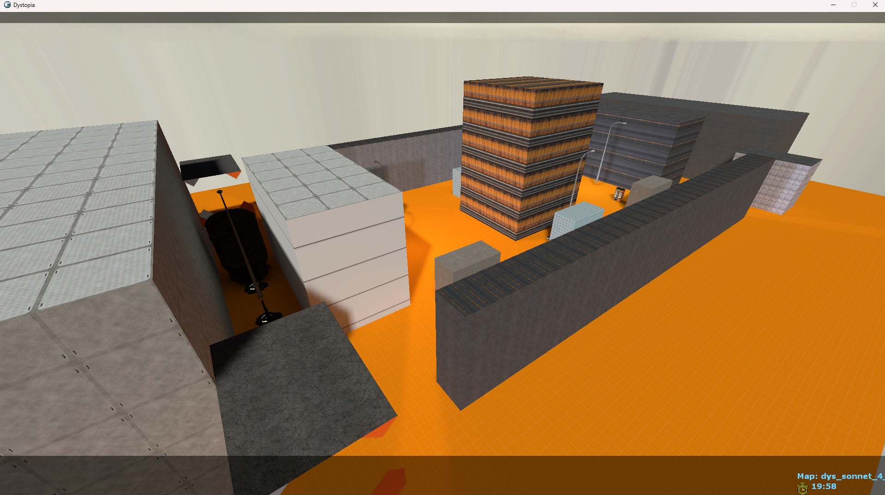 |
