# dystopia_citygen — Benchmark Results

This folder records **benchmark runs** for the dystopia_citygen pipeline: generating a Dystopia map from a natural-language prompt, building the VMF, running a test compile, and fixing any issues so the map loads in-game.

---

## What Was Done

1. **Prompt-driven generation** — A single instruction was given to the generator (see [Prompt](#prompt-used) below).
2. **Map naming** — The generated map was named `dys_<model-name>.vmf` (e.g. `dys_composer_1_5.vmf`) so runs are easy to identify.
3. **Build & compile** — The pipeline was run to produce the VMF and then a **test compile** was executed to ensure the map compiles with the game’s tools.
4. **Fix-up** — Any compile or load errors were diagnosed and fixed so the map runs correctly in Dystopia.
5. **In-game capture** — A screenshot was taken inside Dystopia to document the result and confirm the map loads and looks as intended.

---

## Prompt Used

The following prompt was used for this benchmark:

```
@README.md generate a fancy dystopia map following instructions and call it dys_<model-name>.vmf, after building do a test compile and fix any issues
```

*(Stored in `prompt.txt` in this folder.)*

---

## Benchmark Results

In-game screenshots for each benchmark run. Each map was generated from the same prompt, built to VMF, test-compiled, and fixed as needed so it loads in Dystopia.

| Run | Screenshot |
|-----|------------|
| dys_codex_5_3_thinking | 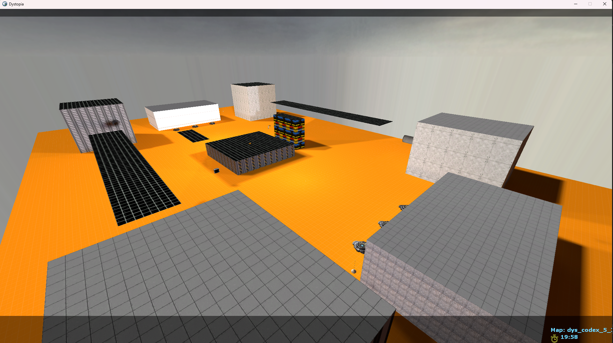 |
| dys_composer_1_5_thinking | 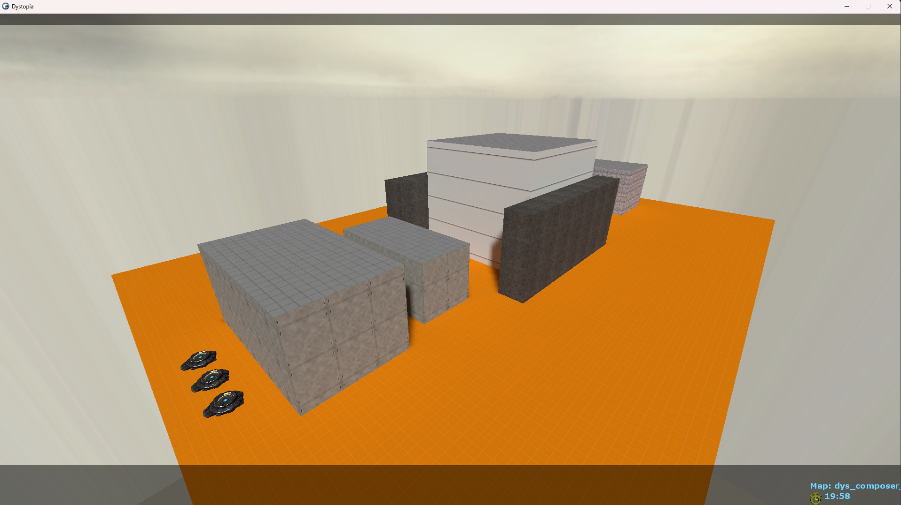 |
| dys_gemini_3_1_pro | 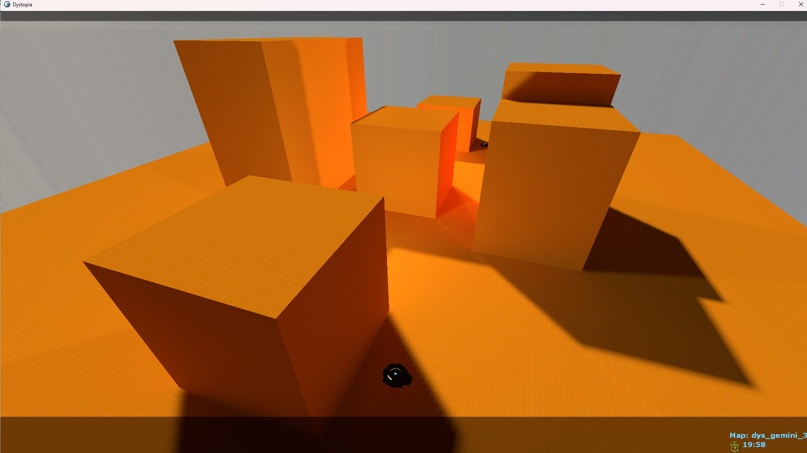 |
| dys_gpt_5_4 | 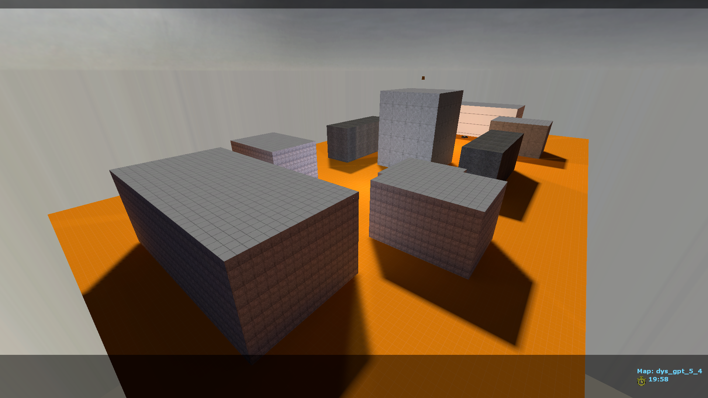 |
| dys_gpt_5_4_high | 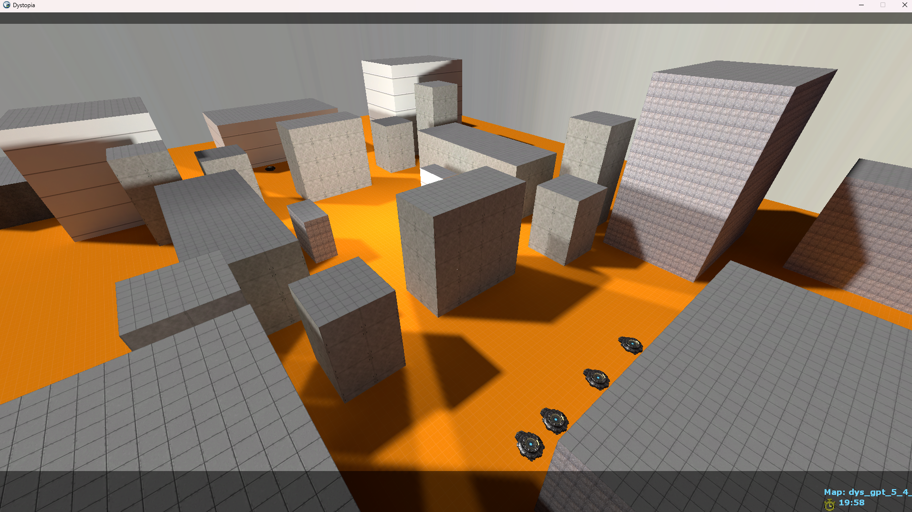 |
| dys_gpt_5_4_xhigh | 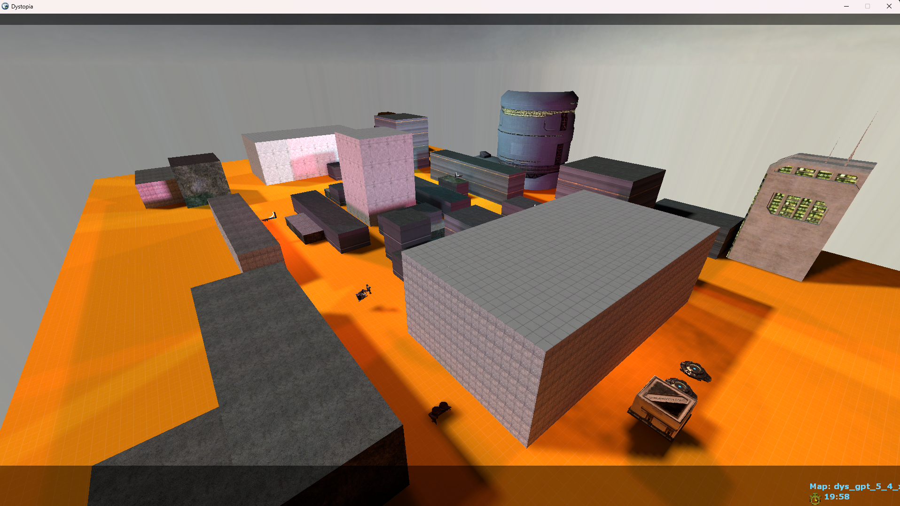 |
| dys_kimi_k25 | 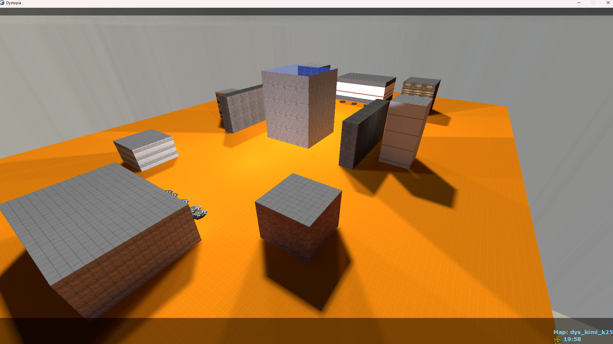 |
| dys_opus_4_6 | 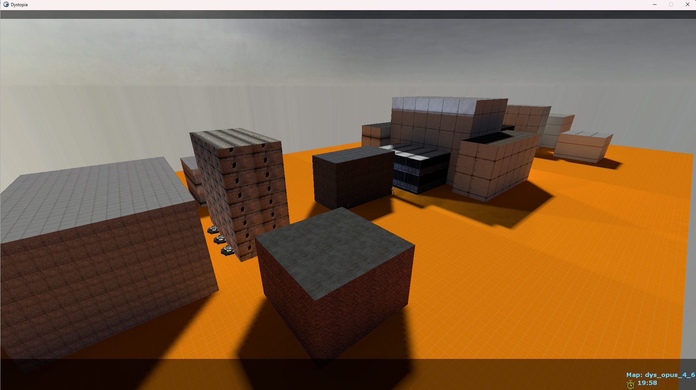 |
| dys_opus_4_6_think | 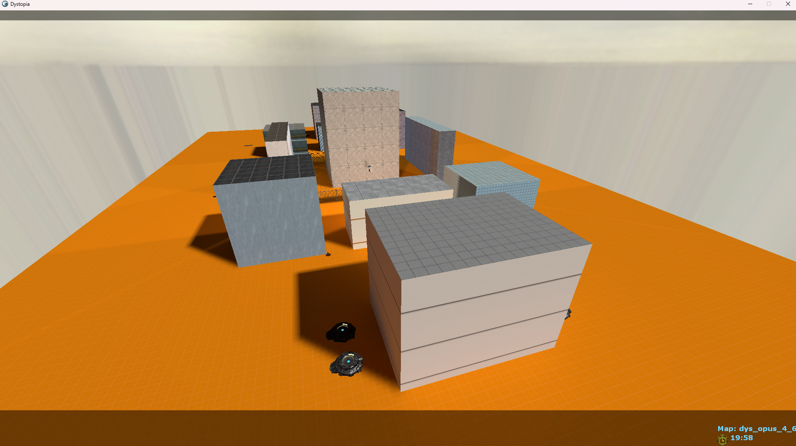 |
| dys_sonnet_4_6 | 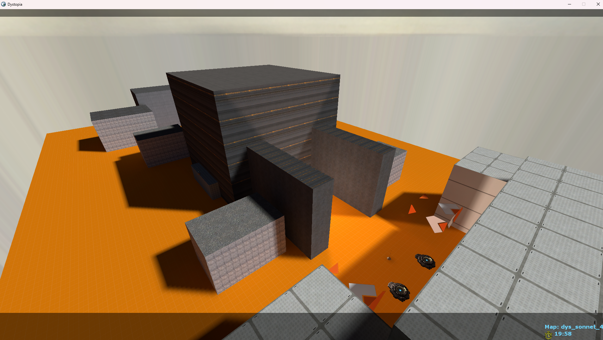 |
| dys_sonnet_4_6_think | 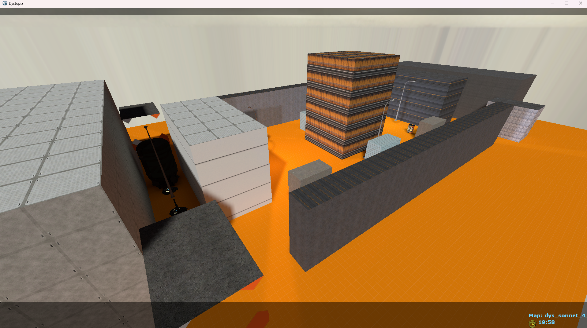 |
| dys_blackice (Opus 5.5, separate run, [see below](#dys_blackice--opus-55-release-quality-run)) | 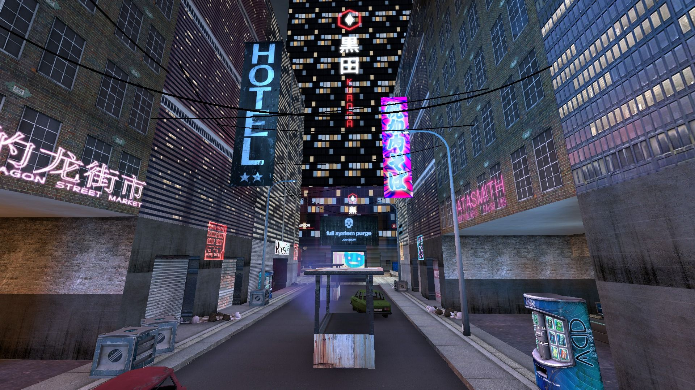 |

---

## dys_blackice — Opus 5.5 (release-quality run)

This run had a different, harder brief and did **not** use the dystopia_citygen pipeline. It is listed
separately rather than as a like-for-like comparison with the runs above.

**Prompt**

```
I want you to build a ready to release dystopia game map, make a plan for yourself how you would conquer this challenge.
```

The user also gave some guidance during the session:
- Don't rely on dystopia_citygen; its output was too basic to play.
- `mp_instantspawn 1` speeds up testing.
- A hint that the jack-in point was missing something. The cause was that brush entities need an `origin` keyvalue.

**Approach**
- **New generator:** written from scratch in Python, in [`dys_blackice/`](../../dys_blackice/). It has a leak-proof box-CSG shell builder, material and texture-band recipes, dressing kits, the gameplay and cyberspace layers, a 3D skybox, and custom textures drawn with Pillow and compiled with vtex.
- **Compile:** Dystopia's own vbsp, vvis and vrad (full vis, `-both -final`), with LDR and HDR cubemaps built in-game.
- **Verification:** automated in-game sessions driven through `-hijack`, including screenshot tours, walk tests on every stair and route, an objective-chain regression, a cyberspace jack-in test, and a load with only the packed content (loose files hidden).

**Result:** `maps/dys_blackice.bsp` v1.0 (23 MB, all content packed inside):
- **Map:** rainy neon megacity at night. Metro station, then a street market, then a corporate plaza, a tower lobby, a server hall and a core vault, plus a cyberspace (5 nodes in v1.0, one open hall with zero-g entry tubes since v1.1/v1.2).
- **Objectives:** three in sequence. Breach the gate (meatspace override or cyberspace hack), crack the security hub, then crash the BLACK ICE core (shield dropped from cyberspace or by destroying its emitters).
- **Gameplay systems:** 4 spawn areas that flip as objectives fall, 7 jack-in points, ICE-guarded terminals, turrets and team forcefields.
- **Release extras:** radar overview, objective guide paths, custom soundscapes, music and a loading screen.
- **Release package:** `dys_blackice_v1.0.zip` (BSP + readme), built locally into `dys_blackice/build/release/` by `release.py zip`.

**Playtest follow-up (v1.1):** the user then played the map and reported:
- The energy crystals and rotating ceiling rings in cyberspace looked wrong.
- The ICE should be the door of small terminal houses.
- The long cyberspace tunnels felt untypical; they wanted one big open room.
- The turrets could not be destroyed.
- The gate turrets covered anyone trying to breach the gate.

In the same session the model rebuilt cyberspace as one open hall with ICE-door houses. It found by in-game
testing that a freshly spawned `npc_turret_ceiling` ignores all damage until it receives `Enable`. The turrets
now take 10 boltgun bolts each, and the gate turrets moved inside the lobby behind the gate.

**Second playtest (v1.2):** a longer session with about 20 screenshot notes. The feedback included:
- things hanging in mid-air
- stairs too steep
- a plaza that was "laser-rifle heaven"
- turrets hitting attackers through the gate
- shutters sticking out of the walls
- a spawn exit blocked by stairs
- a dead-end subway tunnel
- deckers spawning straight into the main cyberspace room

The model fixed all of them:
- A validator now flags floating props, panels and glow sprites.
- Every flight is re-cut at 1:2.
- Annexes and cover narrow the plaza.
- A solid layer in the closed gate blocks the lobby turrets.
- Deckers now float down zero-g tubes behind team ICE.
- A sub-agent modelled a Kuroda monument in Blender for the plaza (replaced by the tree in v1.3).

**Third playtest (v1.3):** the user found the monument "a bit too aggressive with all the spikes" and asked
for five other ideas. Five sub-agents sketched concepts in parallel in Blender, all on one shared stage
(the same plaza stand-in and camera angles). The user picked the Fibre Tree, and the agent that designed it then
built it as the real prop. The same round also made the gate meatspace-only, moved the decker pods and tube
slopes outside the hall, made the tube glass visible from inside, and added alternative routes to objectives 2
and 3 (a north service door into the hub, and a cooling plant route from the hub to the vault).

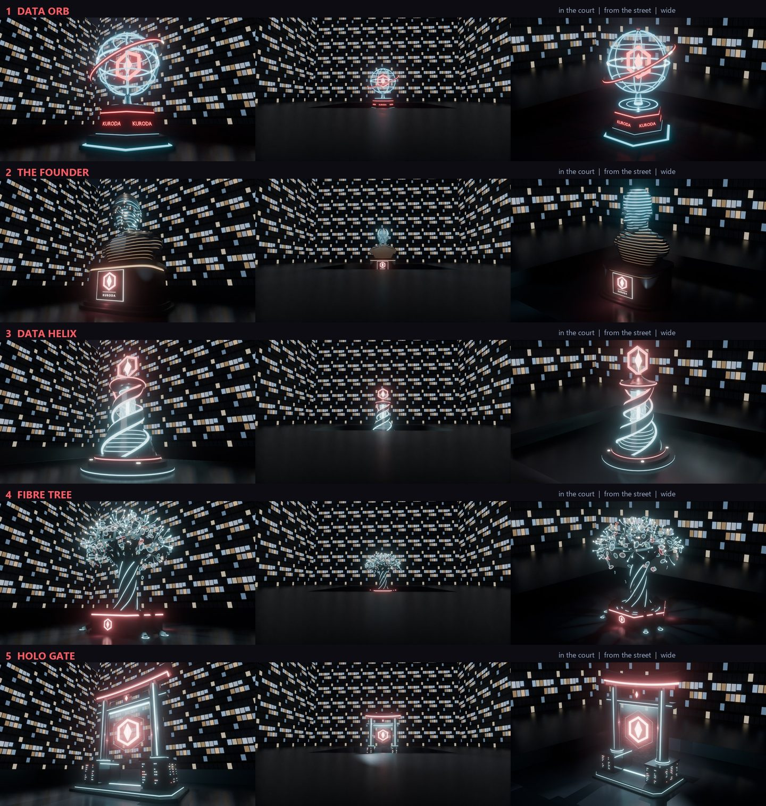

The screenshots below show v1.3.

| | |
|---|---|
|  | 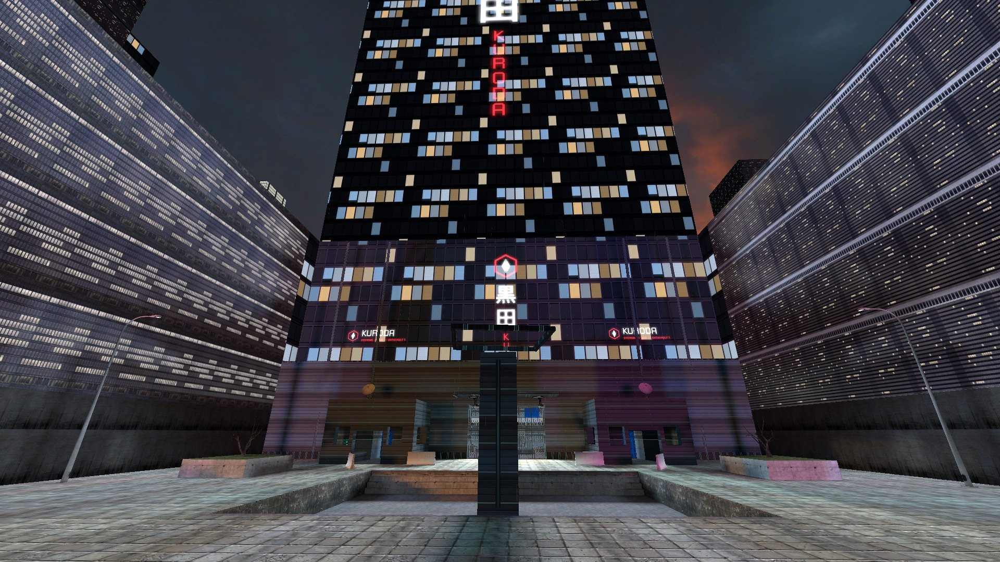 |
| Market street, ending at the plaza's ad tower | Kuroda Plaza with the fibre-optic Kuroda tree |
| 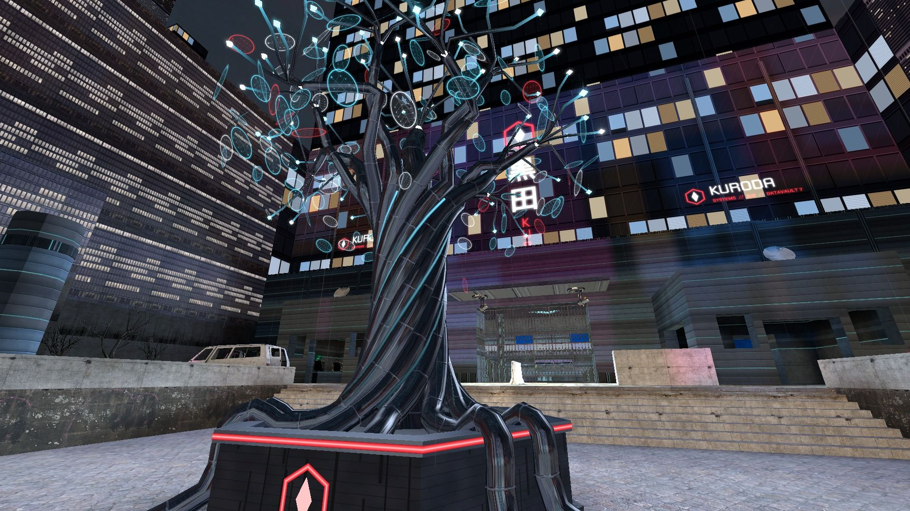 | 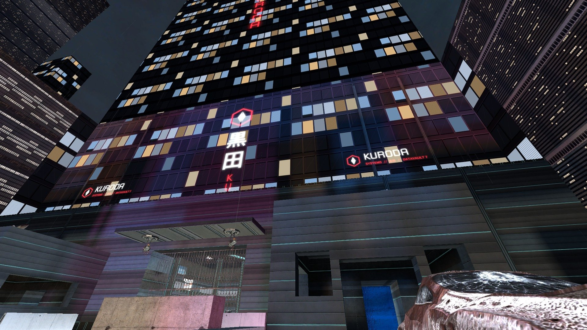 |
| The Kuroda tree (Blender model by a sub-agent) | Obj 1: security gate, canopy turrets and guard posts |
| 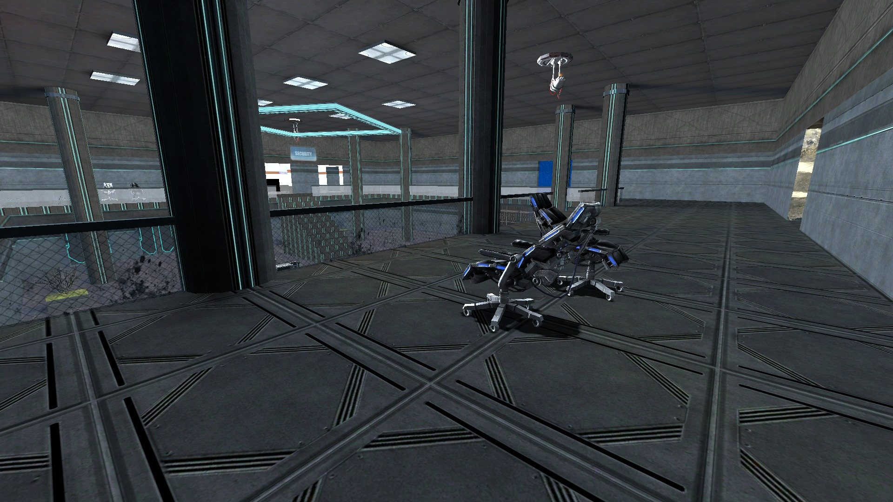 | 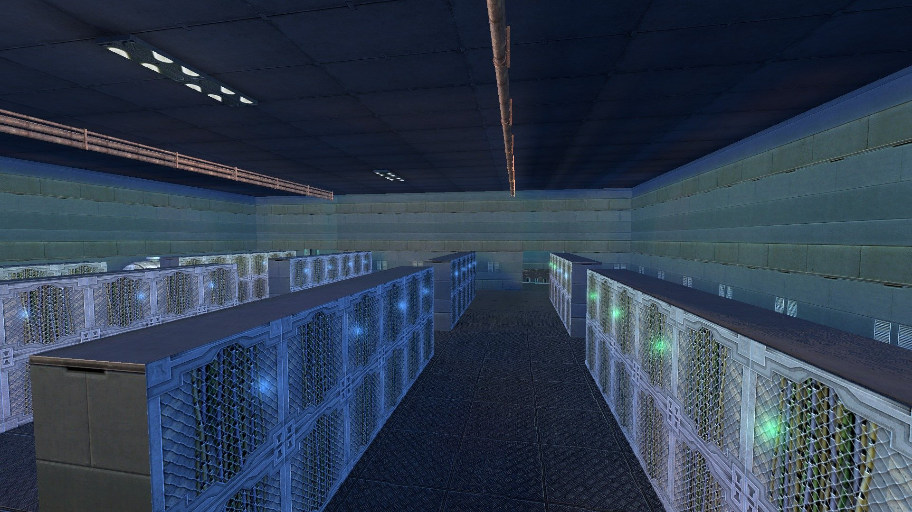 |
| Tower lobby mezzanine | Server hall |
| 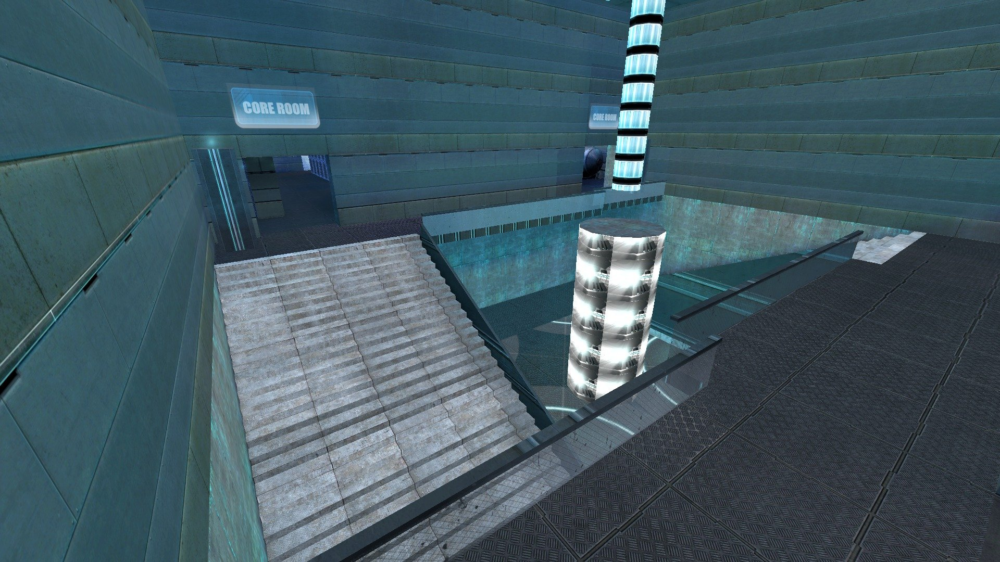 | 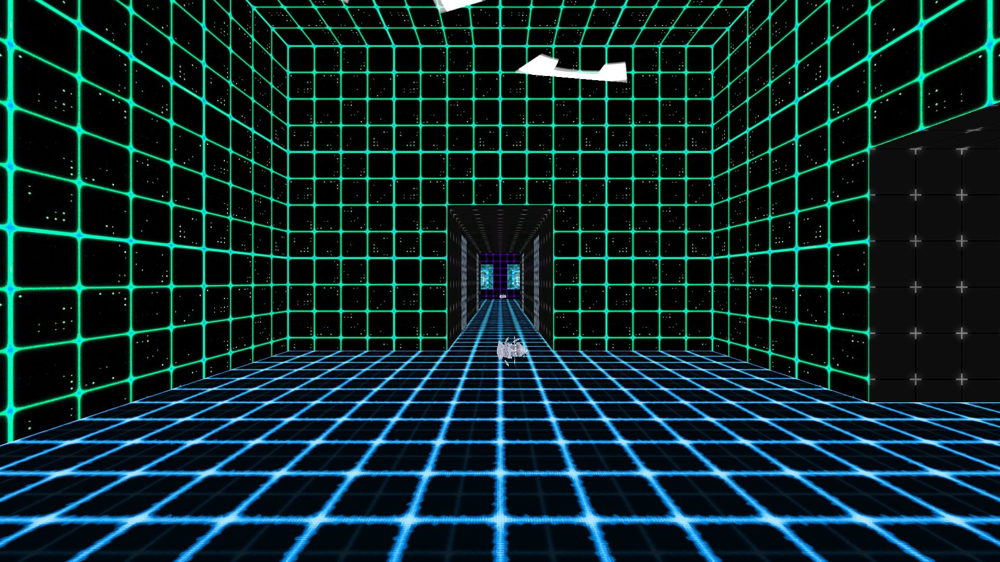 |
| Obj 3: BLACK ICE core vault | Cyberspace hall with zero-g entry tubes |
| 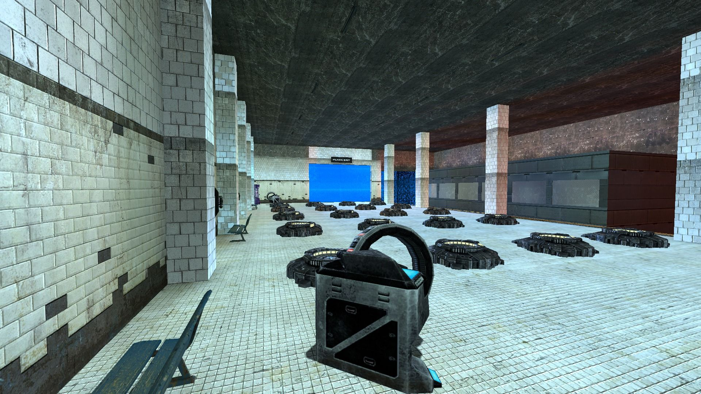 | 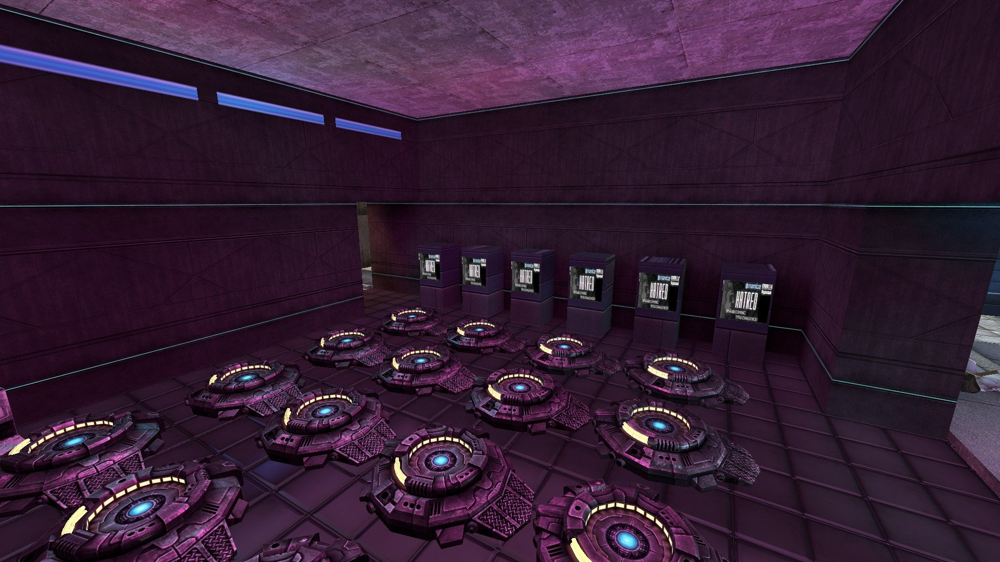 |
| Punk HQ: abandoned metro station | NetExcess Arcade (forward Punk spawn) |
| 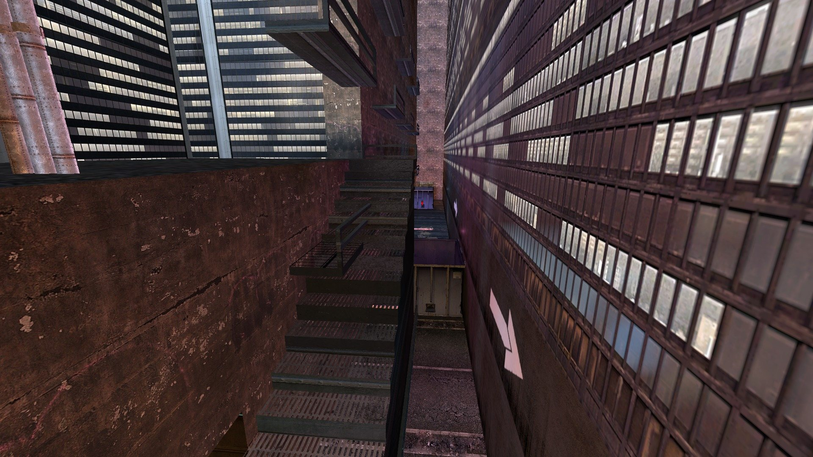 | |
| North alley (flank) | |

Loading screen:

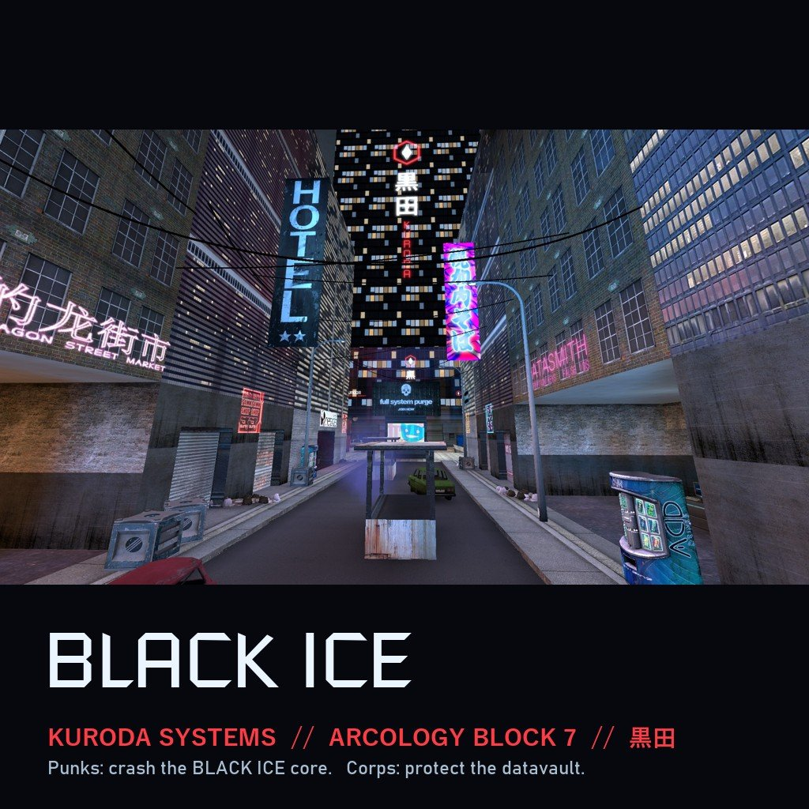
